# SMART_DOG_TOY

---

# SMART_DOG_TOY H/W

---

## 전체 블럭도

---

## Main B/D 및 USB-C 타입 충전 커넥터 보드
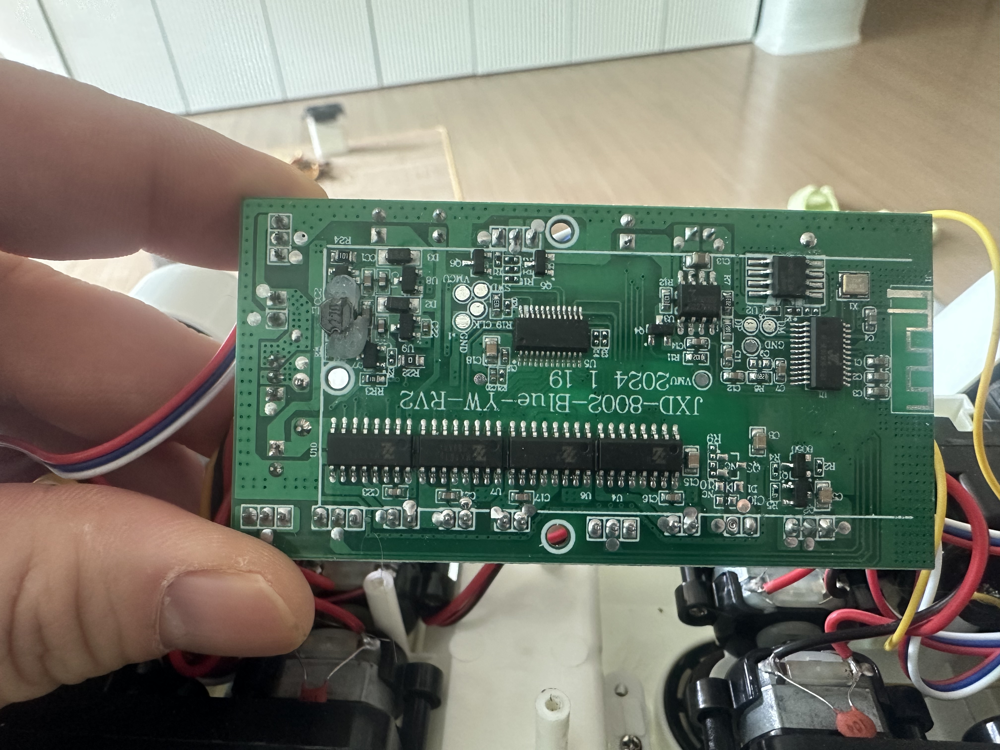 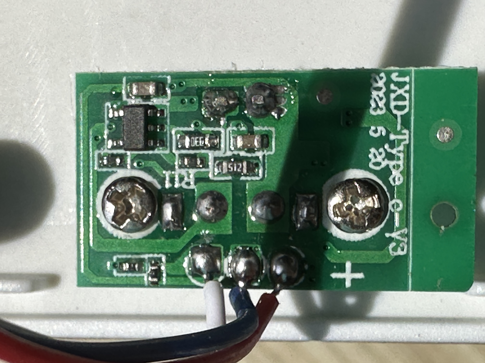  

---

## ???
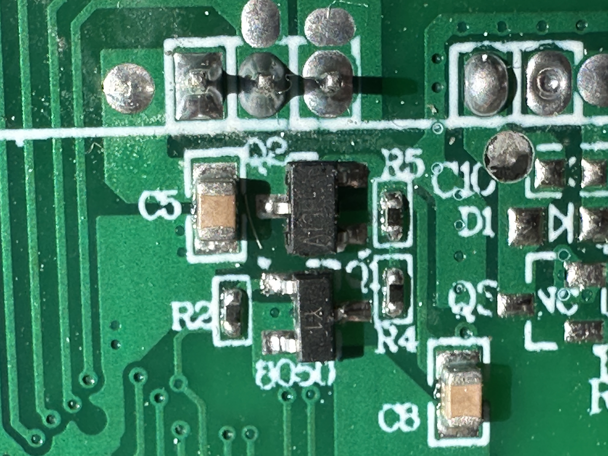 

---

## AF25E003456-65E4? : https://github.com/Jieli-Tech
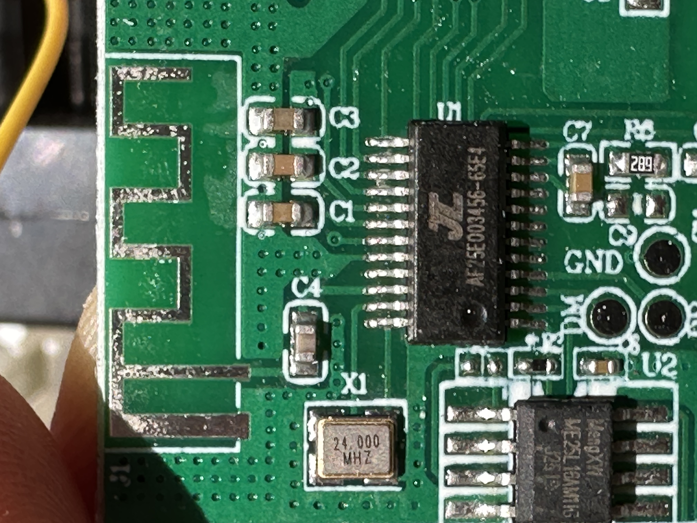 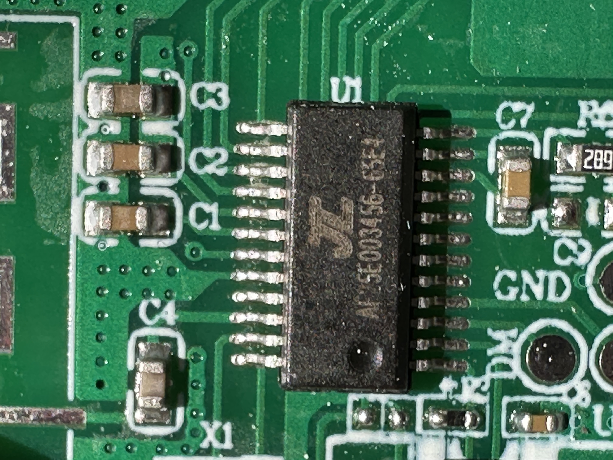 

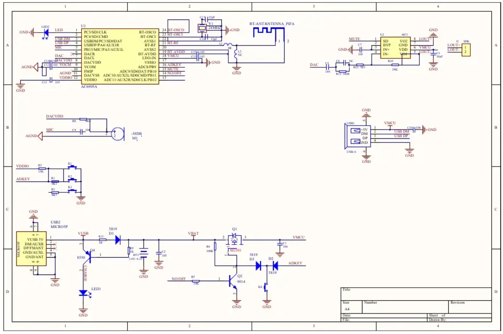

## 1. 칩셋 정체 및 개요

* **실체:** 중국 **JieLi(杰理, 지에리) AC692X 시리즈**(주로 AC6925A) 기반의 커스텀 마킹 SoC.
* **용도:** 블루투스 오디오 수신, MP3 하드웨어 디코딩, MCU 통합 제어.
* **패키지:** **SSOP24** (소형 표면 실장형, 24핀).
* **주요 특징:** * 24MHz 외부 크리스탈 클럭 사용.
    * USB Host 및 SD Card 인터페이스 내장.
    * 고성능 16-bit DAC 및 오디오 출력 지원.
* JieLi의 SSOP24 라인업 중 22번 핀을 안테나로 사용하는 유사 모델들은 다음과 같습니다.

| 모델명 | 22번 핀 기능 | 특징 |
|:-------:|:-------:|:-------:|
| AC6905A | BT_ANT | 22번을 안테나로 쓰는 가장 대표적인 1세대 칩 | 
| AC6955F | BT_ANT | AC6905A의 개선판, 핀 호환성이 매우 높음 | 
| AC608N | BT_ANT | 저가형 라인업, 역시 22번이 안테나 | 
---

## 2. 상세 핀 맵 (SSOP24 패키지 기준)

| 핀 번호 | 명칭 | 기능 설명 및 점검 포인트 |
| :--- | :--- | :--- |
| **1** | **VSS** | 디지털 접지 (GND). |
| ~~**2**~~ | ~~**USB_DM**~~ | ~~USB 데이터 (-) 라인. USB 메모리 재생 시 사용.~~ |
| ~~**3**~~ | ~~**USB_DP**~~ | ~~USB 데이터 (+) 라인.~~ |
| **2** | **USB_DM / UART1_RX** | USB 데이터(-) 또는 UART1 수신(RX) 겸용. |
| **3** | **USB_DP / UART1_TX** | USB 데이터(+) 또는 UART1 송신(TX) 겸용. |
| **4** | **PA1 / TX** | UART 시리얼 송신 또는 일반 I/O (디버깅용). |
| **5~7** | **SD_CLK/CMD/DAT** | 마이크로 SD 카드 인터페이스 라인. |
| **8** | **AD_KEY** | **버튼 입력.** 저항 분배 방식으로 여러 버튼을 인식. |
| **14** | **LDO_IN** | **주 전원 입력 (5V).** USB 또는 배터리 전원 유입부. |
| **15** | **VBAT** | 배터리 연결 및 충전 전압 모니터링 핀. |
| **16** | **VCM** | 내부 레귤레이터 필터 핀 (GND와 커패시터 연결 필수). |
| **18** | **DAC_L** | **좌측 오디오 출력.** LTK8002D 앰프 입력단으로 연결. |
| **19** | **DAC_R** | **우측 오디오 출력.** 스테레오 구성 시 사용. |
| ~~**20**~~ | **VCOM** | DAC 참조 전압 핀. 오디오 노이즈 품질과 직결됨. |
| **20** | **VCOM / FM_IP** | DAC 참조 전압 또는 모델에 따라 FM 라디오 입력. |
| **21** | **VDDIO** | **내부 3.3V 출력.** 칩 로직 전원 (정상 시 3.3V 측정 필수). |
| ~~**22**~~ | **BT_ANT** | **안테나 핀.** 커패시터를 거쳐 PCB 안테나 패턴으로 연결. |
| **22** | **BT_ANT (RF)** | **안테나 핀.** (표준 AC6925A는 GND이나, 본 칩(AF25E...)은 22번을 안테나로 사용) |
| **23** | **OSC_INC** | **24MHz 크리스탈 입력.** 칩 동작 기준 클럭. |
| **24** | **OSC_OUTC** | **24MHz 크리스탈 출력.** |

---

## 3. 주변 핵심 회로 분석

### ① 오디오 증폭부 (LTK8002D)
* **역할:** SoC에서 출력된 DAC 신호를 스피커 구동용 전력(약 3W)으로 증폭.
* **연결 구조:** AF25E(18/19번 핀) → 커플링 커패시터 → **LTK8002D(4번 핀, Input)**.

### ② 클럭 공급부 (OSC)
* **핵심 부품:** 24.000MHz Crystal.
* **점검 방법:** 장치가 동작하지 않거나 블루투스 검색이 안 될 경우, 23/24번 핀의 발진 파형을 우선 점검.

### ③ 전원 및 인터페이스 (ME25L 관련)
* **ME25L:** 회로상 전원 입력 또는 스피커 출력용 **터미널 블록 커넥터**로 추정.
* **전원 계통:** `LDO_IN(14번)`에 5V 유입 확인 → `VDDIO(21번)`에 3.3V 출력 확인.

---

## 4. 유지보수 및 엔지니어링 팁

* **참조 데이터시트:** 상세 설계 사양 확인 시 `AC6925A` 또는 `AC6955F` 데이터시트를 검색하십시오.
* **고주파 노이즈 발생:** `VCOM(20번)` 또는 `VCM(16번)` 핀에 연결된 필터 커패시터 손상/냉납 확인이 필요합니다.
* **블루투스 감도 저하:** `BT_ANT(22번)` 핀과 안테나 사이의 매칭 커패시터(수 pF 단위) 손상 여부를 확인하십시오.

---

## ???
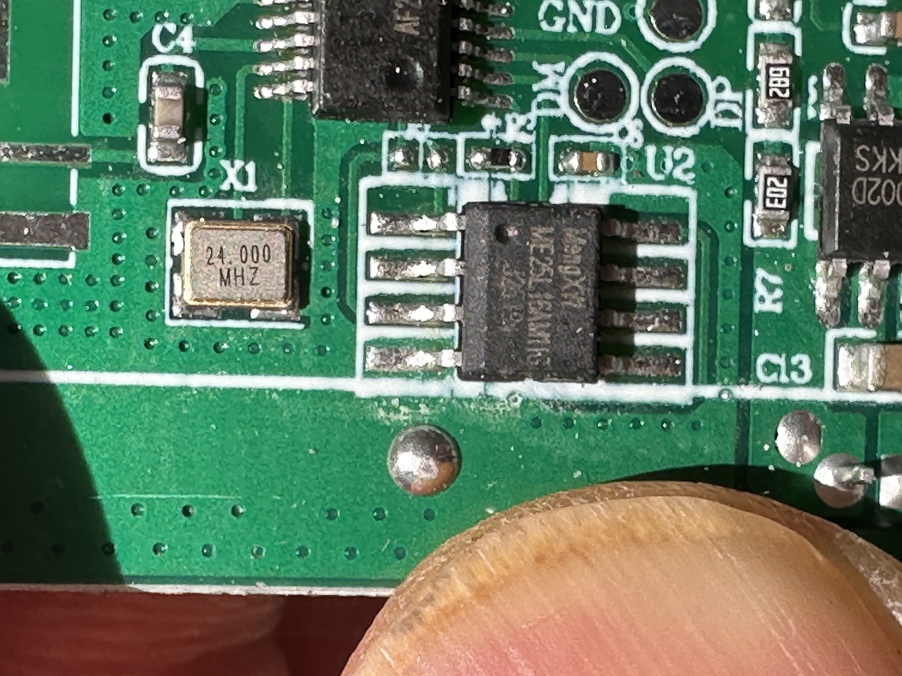 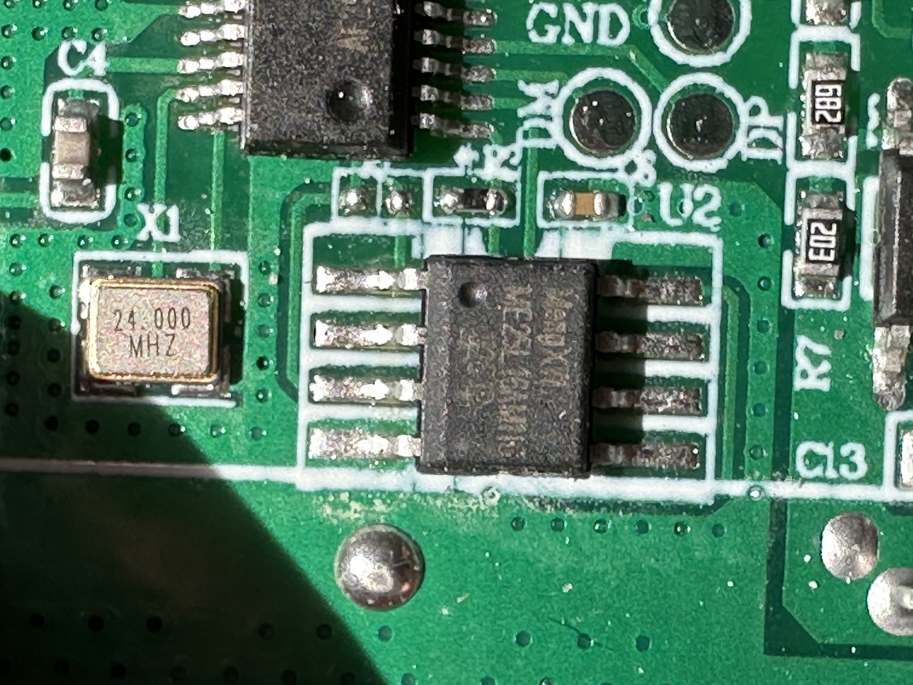 

---

## ???
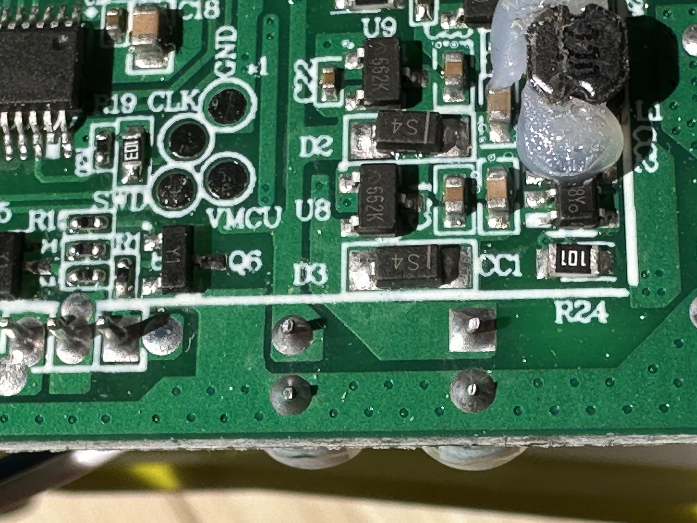 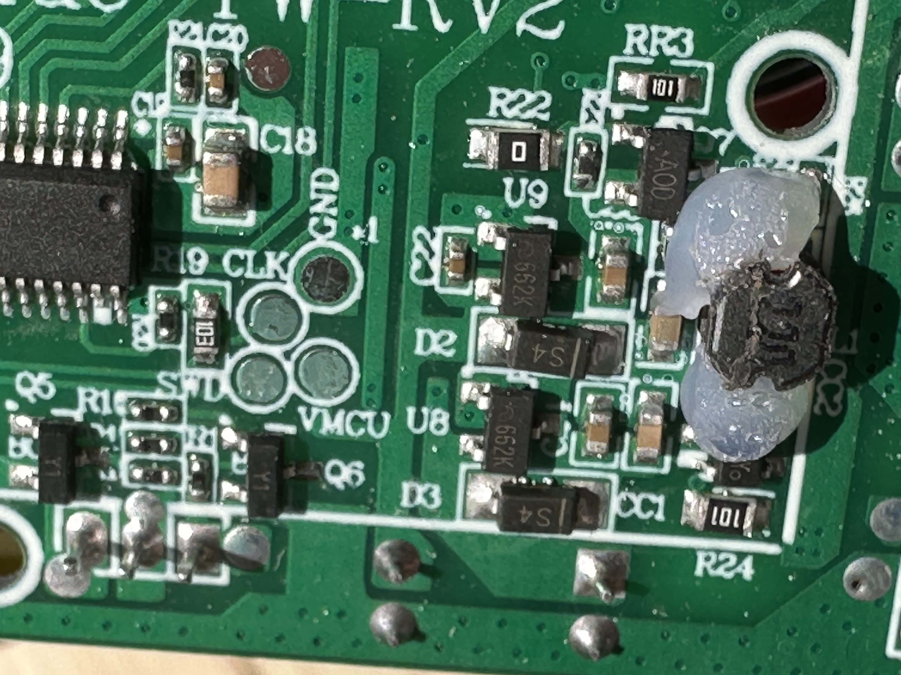 

---

## ???
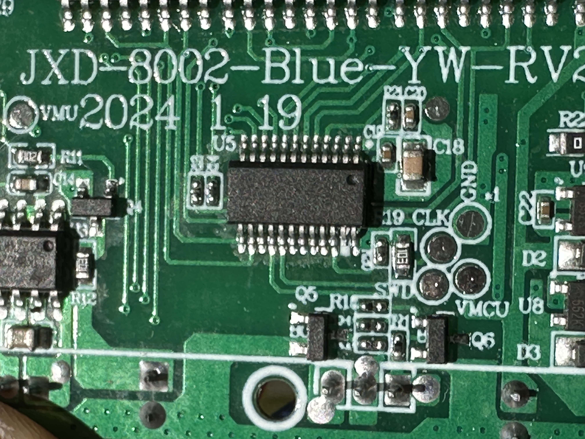 

---

## MA1616S
  * MX161S는 주로 장난감 자동차나 소형 가전제품에서 바퀴 또는 팬의 회전 방향을 제어하는 데 사용되는 H-브리지(H-Bridge) DC 모터 드라이버 IC
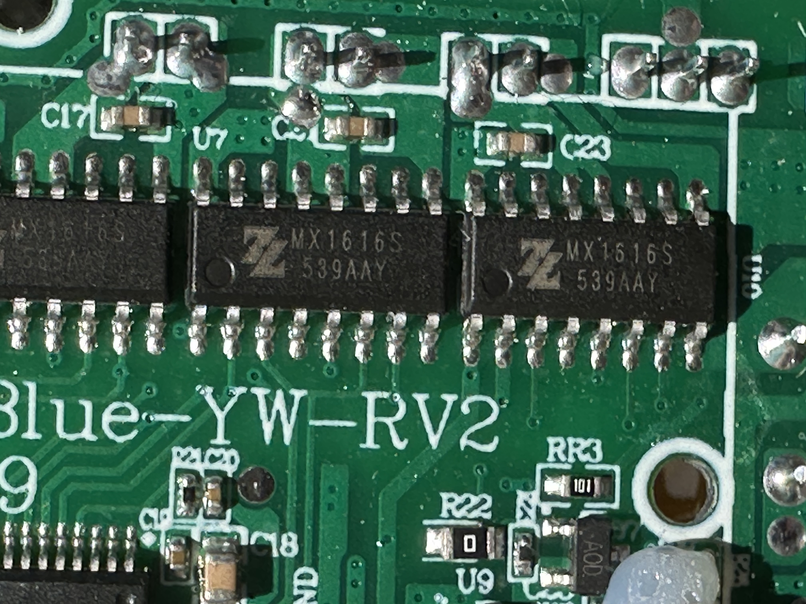 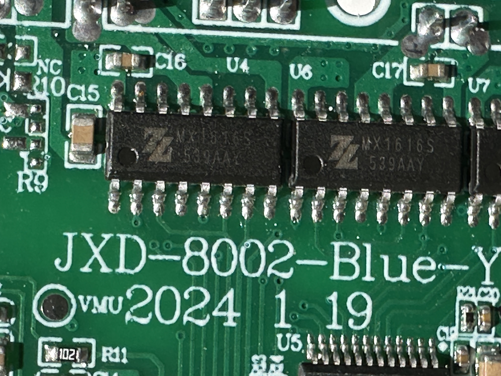 

### 1. 주요 사양 (Specifications)

* https://makerselectronics.com/product/mx1616-dual-motor-driver-board/?srsltid=AfmBOooqKUp4NMEqXSzG3B44PMonS_U2Infvi9fxXXhpgz5shtlp7TNZ

* MX161S와 전압 범위는 비슷하지만, 채널이 두 개로 늘어난 것이 특징입니다.
  * 동작 전압 Vcc = 2 ~ 10V
  * 연속 출력 전류: 채널당 약 1.3~1.5A
  * 최대 피크 전류: 최대 2.5~3A
  * 보호 기능: 과열 보호 회로(TSD) 내장 

### 2. 16핀 구성 (Pinout) 
일반적인 MX1616 계열 16핀 제품의 핀 배열은 다음과 같습니다 (제조사에 따라 미세한 차이가 있을 수 있으니 패턴 확인 권장): 
| 핀 번호	| 이름	| 설명 | 
|:-----:|:-----:|:-----:|
| 1, 8, 9, 16	| GND	| 공통 접지 (일반적으로 4개 핀이 연결됨) | 
| 2, 3	| IN1, IN2		| 모터 A 제어 입력 (MCU 연결) | 
| 4, 5	| OUT1, OUT2		| 모터 A 출력 (모터 단자 연결) | 
| 6, 7	|  VCC | 모터 및 로직 전원 입력 ()
| 10, 11	| IN3, IN4		| 모터 B 제어 입력 (MCU 연결)
| 12, 13	| OUT3, OUT4		| 모터 B 출력 (모터 단자 연결)
| 14, 15	| VCC | 전원 입력 (내부적으로 6, 7번과 연결된 경우가 많음)

### 3. 회로 구성 가이드
#### 3.1. 전원 연결
   * 6, 7, 14, 15번 핀(VCC)에 배터리(+)를,
   * 1, 8, 9, 16번 핀(GND)에 배터리(-)를 연결합니다.
   * 전원 안정화를 위해 와 GND 사이에 전해 커패시터를 추가하는 것이 좋습니다.

#### 3.2. 모터 연결:
   * 첫 번째 모터는 4, 5번(OUT1, OUT2)에 연결합니다.
   * 두 번째 모터는 12, 13번(OUT3, OUT4)에 연결합니다.

#### 3.3. 제어 신호
   * 아두이노 등의 디지털 핀을 IN1~IN4에 연결하여 방향을 제어합니다.
   * 속도 제어가 필요하다면 PWM 신호를 사용합니다. 

### 4. 제어 로직 (모터 A 예시)
* 모터 B도 IN3, IN4를 동일한 로직으로 제어하면 됩니다. 
   * 정회전: IN1 = HIGH, IN2 = LOW
   * 역회전: IN1 = LOW, IN2 = HIGH
   * 브레이크: IN1 = HIGH, IN2 = HIGH (급정지)
   * 대기: IN1 = LOW, IN2 = LOW (자유 회전 정지)

---

## LTK8002D
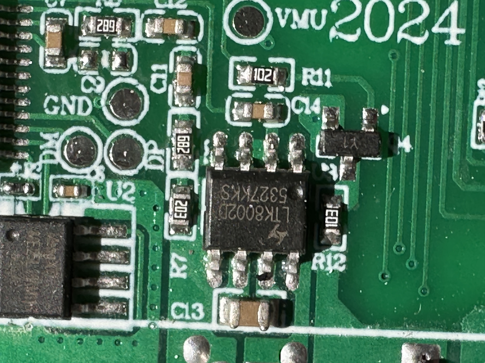 

   * LTK8002D는 SOP-8 패키지로 제공되는 3W 클래스 AB 하이엔드 오디오 전원 증폭기 IC입니다.
   * 5V 동작 조건에서 3옴 부하에 3W의 출력 전력을 제공하며,
   * 블루투스 스피커, 휴대용 기기, 모바일 기기 등 오디오 출력 기능이 필요한 전자 부품에 주로 사용됩니다. 

* 주요 특징 및 사양:
   * 유형: 클래스 AB 오디오 파워 앰프 IC
   * 출력 파워: 3W (5V 전원,3옴 부하, THD+N<10% 기준)
   * 패키지: SOP-8 (패치형)
   * 장점: 우수한 소음 저감(Click and Pop) 회로, 고효율
   * 응용 분야: 휴대용 스피커, 장난감, 게임기, 기타 오디오 기기
