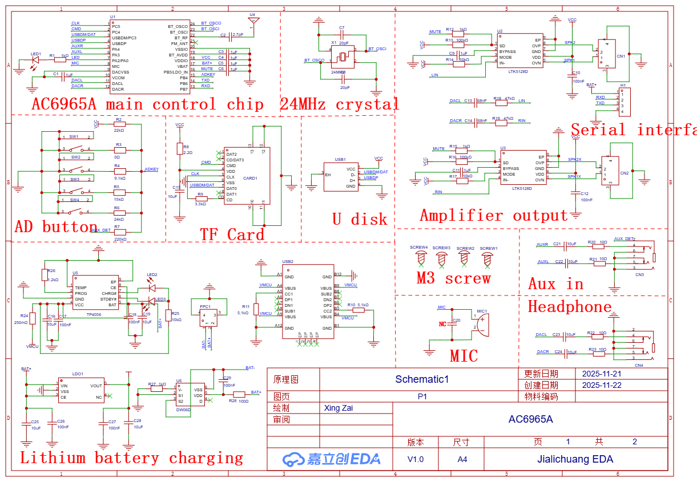

# SMART_DOG_TOY

---

# SMART_DOG_TOY H/W

---

## 전체 블럭도

---

## Main B/D 및 USB-C 타입 충전 커넥터 보드
   

---

1. 예상되는 MCU의 정체:
Artery(아터리) 또는 GigaDevice 계열 (중국산 ARM Cortex-M)중국산 로봇이나 완구류에서 24핀(SOP24/SSOP24) 패키지를 쓰면서 16번 핀에 SWD(Serial Wire Debug) 기능을 배치하는 MCU는 주로 Artery(雅特力, 아터리) 사의 제품일 가능성이 매우 높습니다.후보 모델: AT32F421 / AT32F413 시리즈 (SOP24/SSOP24 패키지)이유: 이 칩셋들은 16번 핀(주로 PA14)에 SWCLK 또는 SWDIO 같은 SWD 핀이 배치되는 경우가 많습니다.클럭 사양: 내부에 고정밀 HICK(Internal High-speed Clock)가 내장되어 있어 별도의 외부 크리스탈 없이 동작하는 경우가 흔합니다. (언급하신 대로 외부 클럭이 없는 것과 일치합니다.)

2. 핀 구성 분석 (추정)알려주신 정보를 바탕으로 분석한 해당 MCU의 특징입니다.16번 핀 (SWD): 이 핀이 SWD로 명시되어 있다면, 이 MCU는 ARM Cortex 코어 기반임을 뜻합니다. 개발자가 펌웨어를 굽거나 디버깅할 때 사용하는 단자입니다.23번 핀 (Floating): AT32F421 등의 24핀 모델에서 23번 핀은 보통 일반 I/O이거나 전원 관련 핀일 수 있는데, 사용하지 않고 띄워둔 것으로 보입니다.클럭 공유: 블루투스 칩의 24MHz를 가져다 쓸 수도 있지만, 이런 저가형 설계에서는 MCU 내부 클럭(Internal RC Oscillator)을 사용하여 회로를 최대한 간소화하는 경우가 더 많습니다.

3. 전체 시스템 구조 (Data Flow)현재 분석 중인 로봇개의 논리적 구조는 다음과 같이 정리됩니다.사용자 명령: 스마트폰 앱 → AC6965A (블루투스) 수신.명령 전달: AC6965A → UART 통신(2, 3번 핀 활용 가능) → 메인 MCU (24핀 SOP).동작 제어: 메인 MCU → PWM 신호 발생 → MA1616S (모터 드라이버 4개) → 4족 보행 제어.피드백/효과음: 메인 MCU → AC6965A 명령 → LTK8002D → 스피커 출력.
  
4. 추가 확인 팁이 MCU의 정확한 모델명을 알기 위해 다음을 확인해 보세요.핀 전압: 1번이나 마지막 핀 근처에 3.3V 전원($V_{DD}$)과 GND($V_{SS}$)가 어디에 배치되어 있는지 멀티미터로 찍어보세요. (보통 AT32 시리즈는 핀 중간이나 끝에 전원이 배치됩니다.)

---

1. 가장 유력한 후보: Artery (雅特力) AT32F421G8S7
중국 로봇 및 모터 제어 시장에서 가장 많이 쓰이는 ARM Cortex-M4 기반 MCU입니다.

특징: 고성능이면서 가격이 저렴해 4족 보행 로봇의 복잡한 보행 알고리즘을 처리하기에 적합합니다.

핀 매칭: 24핀 SOP 패키지 버전이 존재하며, 내부 고속 클럭(HICK)을 사용하여 외부 크리스탈 없이 작동합니다.

SWD 위치: 보통 PA14(SWCLK), PA13(SWDIO)가 16번 근처에 배치되는 경우가 많아 정황상 매우 일치합니다.

2. 또 다른 후보: Puya (普冉) PY32F030 시리즈
최근 중국에서 "가장 싼 32비트 MCU"로 각광받는 제품입니다.

특징: 저가형 로봇 완구나 단순 제어기에 폭발적으로 사용됩니다.

핀 매칭: 24핀 패키지 라인업이 있으며, 내부 클럭을 주로 사용합니다.

SWD: 16번 핀이 SWD 관련 핀(SWDIO/SWCLK)으로 할당된 경우가 흔합니다.

3. 기술적 정황 분석 (로봇개 구조)
이 MCU가 하는 역할은 "Motion Controller"입니다.

통신: 블루투스 칩(AC6965A)에서 시리얼(UART)로 명령을 받아 파싱합니다.

연산: 로봇개의 4족 보행(Gait)에 필요한 4개 모터의 위상차와 PWM 듀티비를 계산합니다.

출력: 4개의 MA1616S 모터 드라이버에 총 8개(정/역 제어용) 이상의 PWM 신호를 보냅니다.

클럭: 블루투스 칩의 24MHz 클럭 소스를 공유할 수도 있지만, 23번 핀을 플로팅했다면 내부 RC 오실레이터를 사용하여 48MHz~72MHz 정도로 뻥튀기(PLL)해서 쓰고 있을 확률이 높습니다.

# 기술 분석 리포트: 4족 보행 로봇 제어 시스템

본 리포트는 블루투스 통신 모듈과 메인 MCU, 그리고 모터 드라이브 회로가 통합된 4족 로봇개의 시스템 구조 분석 결과입니다.

---

## 1. 시스템 아키텍처 (System Architecture)

1.  **통신/오디오 (Sub-SoC):** AF25E... (JieLi AC6965A 기반)
    * 블루투스 명령 수신 및 오디오 효과음 출력 담당.
2.  **메인 컨트롤러 (Main MCU):** 24핀 SOP 패키지 (AT32F421 또는 PY32F030 추정)
    * 보행 알고리즘 계산 및 4개의 모터 드라이버(PWM) 제어 담당.
3.  **구동부 (Motor Driver):** MA1616S x 4개
    * 4개 다리의 기어드 DC 모터 독립 구동.
4.  **최종 출력:** LTK8002D 앰프를 통한 음성 출력.

---

## 모터제어 방법

서보모터는 내부에 제어 회로와 각도 센서(포텐셔미터)가 있어 원하는 각도를 명령만 하면 스스로 찾아가지만, 기어드 DC 모터는 전원을 넣으면 계속 회전하는 특성을 가집니다.

로봇개처럼 정교한 움직임이 필요한 장치에서 DC 모터로 각도를 제어하려면 크게 두 가지 방식이 사용됩니다.

1. 물리적 리미트(Limit)와 전류 감지 (저가형/완구형 방식)
가장 간단하고 저렴한 방식입니다. 별도의 센서 없이 '시간'과 '부하'를 이용합니다.

스토퍼(Stopper) 활용: 로봇 다리가 움직일 수 있는 최대/최소 각도 지점에 물리적인 턱(Stopper)을 만듭니다.

전류 감지 (Current Sensing): 모터가 회전하다가 스토퍼에 걸려 더 이상 못 움직이게 되면 모터에 흐르는 전류값이 급격히 상승합니다. 메인 MCU는 이 전류 변화를 감지하여 "아, 끝까지 왔구나"라고 판단하고 정지시킵니다.

시간 제어: 끝 지점을 확인한 후, "0.5초 동안 역회전" 같은 방식으로 대략적인 각도를 맞춥니다. 정밀도는 낮지만 회로가 단순합니다.

2. 엔코더(Encoder) 또는 외부 센서 활용 (정밀 제어 방식)
DC 모터의 회전축이나 다리의 관절 부위에 회전수나 각도를 측정하는 센서를 추가하는 방식입니다.

홀 센서(Hall Sensor) 엔코더: 모터 축에 작은 자석을 달고, 칩이 자석의 회전 횟수를 카운트합니다. 기어비가 100:1이라면 모터 축이 100번 돌 때 다리가 1번 움직이므로, 매우 정밀한 각도 계산이 가능합니다.

가변 저항(Potentiometer): 관절 부위에 가변 저항을 달아 다리가 움직일 때마다 변하는 전압값을 MCU가 읽어 각도를 파악합니다. (서보모터 내부의 원리와 동일)

3. 현재 분석 중인 로봇개(MA1616S 사용)의 경우
분석하신 MA1616S 드라이버와 각인이 지워진 MCU 조합을 볼 때, 이 로봇은 다음과 같은 메커니즘을 사용할 가능성이 높습니다.

추정 방식: '카운트 기반의 시간 제어 + 전류 감지'

MA1616S 자체에 과전류 보호 기능이 있거나 MCU가 분배 저항을 통해 모터 부하를 모니터링할 것입니다.

4족 로봇개의 특성상 다리가 바닥에 닿았을 때의 부하 변화를 감지하여 보행 패턴을 조절합니다.

MA1616S의 역할: MCU에서 나오는 PWM 신호에 따라 모터에 공급되는 전압의 양을 조절하여 속도와 힘(토크)을 제어합니다.

## 5. 관절 제어 메커니즘 (Joint Control)

* **구동원:** 4개의 기어드 DC 모터 (Non-Servo).
* **제어 방식:**
    1.  **Open-loop Time Control:** 특정 시간 동안 PWM을 인가하여 각도 제어.
    2.  **Stall Detection (추정):** 모터가 물리적 한계치에 도달했을 때 발생하는 전류 피크를 MCU가 감지하여 원점(Home Position)을 설정.
* **장단점:** 서보모터 대비 정밀도는 낮으나 구조가 단순하고 충격에 강해 험지 보행 시 기어 파손 위험이 적음.

---

## 2. 메인 MCU 분석 (24핀 SOP)

* **정체:** 외부 각인이 제거된 상태이나, 핀 구성상 ARM Cortex-M 시리즈(Artery/Puya)로 추정.
* **핀 특징:**
    * **16번 핀:** SWD (Serial Wire Debug) 포트 - 펌웨어 프로그래밍 및 디버깅용.
    * **23번 핀:** Floating (미사용).
    * **클럭:** 외부 크리스탈 미사용 (내부 RC 오실레이터 기반 동작).
    * **제어 신호:** MA1616S 드라이버로 PWM 신호 송출.

---

## 3. 통신 및 오디오 모듈 (AF25E... / AC6965A)

| 핀 번호 | 기능 | 비고 |
| :--- | :--- | :--- |
| **2** | **UART1_RX** | 메인 MCU로부터 상태 수신 또는 데이터 입력. |
| **3** | **UART1_TX** | 메인 MCU로 사용자 블루투스 명령 전달. |
| **18, 19**| **DAC_L/R** | LTK8002D 오디오 앰프 입력으로 연결. |
| **22** | **BT_ANT** | 캡(Cap)을 통한 안테나 패턴 연결. |
| **23, 24**| **24MHz OSC** | 외부 크리스탈 클럭 사용. |

---

## 4. 모터 드라이버부 (MA1616S)

* **수량:** 4개 (다리당 1개 배정).
* **입력:** 메인 MCU로부터 정/역/정지 제어 신호 수신.
* **출력:** 기어드 DC 모터 직접 구동.

---

## ???
 

---

## AF25E003456-65E4? : https://github.com/Jieli-Tech
  

## 1. 칩셋 정체 및 개요

* **실체:** 중국 **JieLi(杰理, 지에리) AC692X 시리즈**(주로 AC6925A) 기반의 커스텀 마킹 SoC.
* **용도:** 블루투스 오디오 수신, MP3 하드웨어 디코딩, MCU 통합 제어.
* **패키지:** **SSOP24** (소형 표면 실장형, 24핀).
* **주요 특징:** * 24MHz 외부 크리스탈 클럭 사용.
    * USB Host 및 SD Card 인터페이스 내장.
    * 고성능 16-bit DAC 및 오디오 출력 지원.
* JieLi의 SSOP24 라인업 중 22번 핀을 안테나로 사용하는 유사 모델들은 다음과 같습니다.

| 모델명 | 22번 핀 기능 | 특징 |
|:-------:|:-------:|:-------:|
| AC6905A | BT_ANT | 22번을 안테나로 쓰는 가장 대표적인 1세대 칩 | 
| AC6955F | BT_ANT | AC6905A의 개선판, 핀 호환성이 매우 높음 | 
| AC608N | BT_ANT | 저가형 라인업, 역시 22번이 안테나 | 
---

## 2. 상세 핀 맵 (SSOP24 패키지 기준)

| 핀 번호 | 명칭 | 기능 설명 및 점검 포인트 |
| :--- | :--- | :--- |
| **1** | **VSS** | 디지털 접지 (GND). |
| ~~**2**~~ | ~~**USB_DM**~~ | ~~USB 데이터 (-) 라인. USB 메모리 재생 시 사용.~~ |
| ~~**3**~~ | ~~**USB_DP**~~ | ~~USB 데이터 (+) 라인.~~ |
| **2** | **USB_DM / UART1_RX** | USB 데이터(-) 또는 UART1 수신(RX) 겸용. |
| **3** | **USB_DP / UART1_TX** | USB 데이터(+) 또는 UART1 송신(TX) 겸용. |
| **4** | **PA1 / TX** | UART 시리얼 송신 또는 일반 I/O (디버깅용). |
| **5~7** | **SD_CLK/CMD/DAT** | 마이크로 SD 카드 인터페이스 라인. |
| **8** | **AD_KEY** | **버튼 입력.** 저항 분배 방식으로 여러 버튼을 인식. |
| **14** | **LDO_IN** | **주 전원 입력 (5V).** USB 또는 배터리 전원 유입부. |
| **15** | **VBAT** | 배터리 연결 및 충전 전압 모니터링 핀. |
| **16** | **VCM** | 내부 레귤레이터 필터 핀 (GND와 커패시터 연결 필수). |
| **18** | **DAC_L** | **좌측 오디오 출력.** LTK8002D 앰프 입력단으로 연결. |
| **19** | **DAC_R** | **우측 오디오 출력.** 스테레오 구성 시 사용. |
| ~~**20**~~ | **VCOM** | DAC 참조 전압 핀. 오디오 노이즈 품질과 직결됨. |
| **20** | **VCOM / FM_IP** | DAC 참조 전압 또는 모델에 따라 FM 라디오 입력. |
| **21** | **VDDIO** | **내부 3.3V 출력.** 칩 로직 전원 (정상 시 3.3V 측정 필수). |
| ~~**22**~~ | **BT_ANT** | **안테나 핀.** 커패시터를 거쳐 PCB 안테나 패턴으로 연결. |
| **22** | **BT_ANT (RF)** | **안테나 핀.** (표준 AC6925A는 GND이나, 본 칩(AF25E...)은 22번을 안테나로 사용) |
| **23** | **OSC_INC** | **24MHz 크리스탈 입력.** 칩 동작 기준 클럭. |
| **24** | **OSC_OUTC** | **24MHz 크리스탈 출력.** |

---

## 3. 주변 핵심 회로 분석

### ① 오디오 증폭부 (LTK8002D)
* **역할:** SoC에서 출력된 DAC 신호를 스피커 구동용 전력(약 3W)으로 증폭.
* **연결 구조:** AF25E(18/19번 핀) → 커플링 커패시터 → **LTK8002D(4번 핀, Input)**.

### ② 클럭 공급부 (OSC)
* **핵심 부품:** 24.000MHz Crystal.
* **점검 방법:** 장치가 동작하지 않거나 블루투스 검색이 안 될 경우, 23/24번 핀의 발진 파형을 우선 점검.

### ③ 전원 및 인터페이스 (ME25L 관련)
* **ME25L:** 회로상 전원 입력 또는 스피커 출력용 **터미널 블록 커넥터**로 추정.
* **전원 계통:** `LDO_IN(14번)`에 5V 유입 확인 → `VDDIO(21번)`에 3.3V 출력 확인.

---

## 4. 유지보수 및 엔지니어링 팁

* **참조 데이터시트:** 상세 설계 사양 확인 시 `AC6925A` 또는 `AC6955F` 데이터시트를 검색하십시오.
* **고주파 노이즈 발생:** `VCOM(20번)` 또는 `VCM(16번)` 핀에 연결된 필터 커패시터 손상/냉납 확인이 필요합니다.
* **블루투스 감도 저하:** `BT_ANT(22번)` 핀과 안테나 사이의 매칭 커패시터(수 pF 단위) 손상 여부를 확인하십시오.

---

## ???
  

---

## ???
  

---

## ???
 

---

## MA1616S
  * MX161S는 주로 장난감 자동차나 소형 가전제품에서 바퀴 또는 팬의 회전 방향을 제어하는 데 사용되는 H-브리지(H-Bridge) DC 모터 드라이버 IC
  

### 1. 주요 사양 (Specifications)

* https://makerselectronics.com/product/mx1616-dual-motor-driver-board/?srsltid=AfmBOooqKUp4NMEqXSzG3B44PMonS_U2Infvi9fxXXhpgz5shtlp7TNZ

* MX161S와 전압 범위는 비슷하지만, 채널이 두 개로 늘어난 것이 특징입니다.
  * 동작 전압 Vcc = 2 ~ 10V
  * 연속 출력 전류: 채널당 약 1.3~1.5A
  * 최대 피크 전류: 최대 2.5~3A
  * 보호 기능: 과열 보호 회로(TSD) 내장 

### 2. 16핀 구성 (Pinout) 
일반적인 MX1616 계열 16핀 제품의 핀 배열은 다음과 같습니다 (제조사에 따라 미세한 차이가 있을 수 있으니 패턴 확인 권장): 
| 핀 번호	| 이름	| 설명 | 
|:-----:|:-----:|:-----:|
| 1, 8, 9, 16	| GND	| 공통 접지 (일반적으로 4개 핀이 연결됨) | 
| 2, 3	| IN1, IN2		| 모터 A 제어 입력 (MCU 연결) | 
| 4, 5	| OUT1, OUT2		| 모터 A 출력 (모터 단자 연결) | 
| 6, 7	|  VCC | 모터 및 로직 전원 입력 ()
| 10, 11	| IN3, IN4		| 모터 B 제어 입력 (MCU 연결)
| 12, 13	| OUT3, OUT4		| 모터 B 출력 (모터 단자 연결)
| 14, 15	| VCC | 전원 입력 (내부적으로 6, 7번과 연결된 경우가 많음)

### 3. 회로 구성 가이드
#### 3.1. 전원 연결
   * 6, 7, 14, 15번 핀(VCC)에 배터리(+)를,
   * 1, 8, 9, 16번 핀(GND)에 배터리(-)를 연결합니다.
   * 전원 안정화를 위해 와 GND 사이에 전해 커패시터를 추가하는 것이 좋습니다.

#### 3.2. 모터 연결:
   * 첫 번째 모터는 4, 5번(OUT1, OUT2)에 연결합니다.
   * 두 번째 모터는 12, 13번(OUT3, OUT4)에 연결합니다.

#### 3.3. 제어 신호
   * 아두이노 등의 디지털 핀을 IN1~IN4에 연결하여 방향을 제어합니다.
   * 속도 제어가 필요하다면 PWM 신호를 사용합니다. 

### 4. 제어 로직 (모터 A 예시)
* 모터 B도 IN3, IN4를 동일한 로직으로 제어하면 됩니다. 
   * 정회전: IN1 = HIGH, IN2 = LOW
   * 역회전: IN1 = LOW, IN2 = HIGH
   * 브레이크: IN1 = HIGH, IN2 = HIGH (급정지)
   * 대기: IN1 = LOW, IN2 = LOW (자유 회전 정지)

---

## LTK8002D
 

   * LTK8002D는 SOP-8 패키지로 제공되는 3W 클래스 AB 하이엔드 오디오 전원 증폭기 IC입니다.
   * 5V 동작 조건에서 3옴 부하에 3W의 출력 전력을 제공하며,
   * 블루투스 스피커, 휴대용 기기, 모바일 기기 등 오디오 출력 기능이 필요한 전자 부품에 주로 사용됩니다. 

* 주요 특징 및 사양:
   * 유형: 클래스 AB 오디오 파워 앰프 IC
   * 출력 파워: 3W (5V 전원,3옴 부하, THD+N<10% 기준)
   * 패키지: SOP-8 (패치형)
   * 장점: 우수한 소음 저감(Click and Pop) 회로, 고효율
   * 응용 분야: 휴대용 스피커, 장난감, 게임기, 기타 오디오 기기
